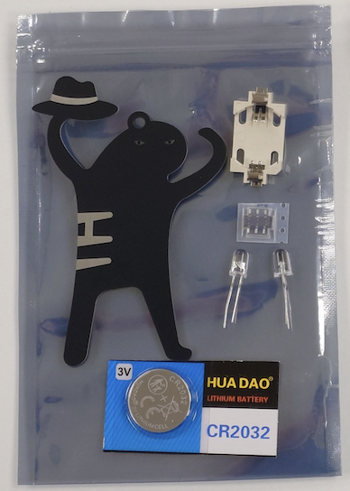
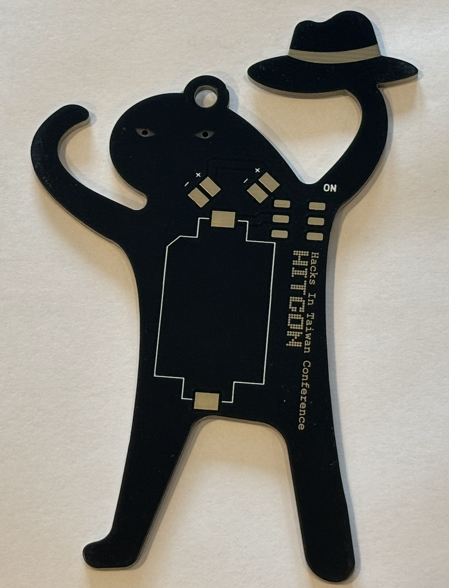
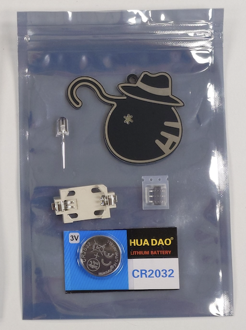
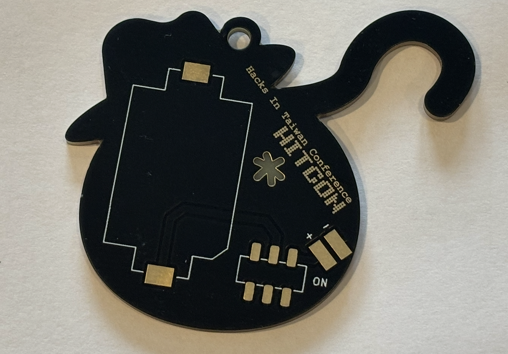

# HITCON 2026 PCB 焊接體驗 / Soldering Area

咪咪喵喵 與 \*駭客喵喵
焊接步驟說明 / Manual for soldering steps

**電路焊接時務必注意安全 / Exercise extreme caution and observe all safety precautions when soldering circuits.**

## 目錄 / TOS

- 包裝內容 / Packaging contents (BOM)
    - 咪咪貓貓
    - \*駭客喵喵
    
- 焊接步驟 / Soldering steps
    1. LED
    2. 開關 / Swtich
    3. 電池盒 / Battery box
    4. 測試 / Testing

> 以下為建議步驟，若您有更順手的方式，也能自行創意，發揮駭客精神。 / 
> The following are suggested steps. If you have a more convenient method, you can also get creative and unleash your hacker spirit.

## 包裝內容 / Packaging contents (BOM)

### 咪咪貓貓
|材料名稱 / Material |數量 / Usage|
|:-----:|:-:|
|PCB|1|
|LED|2|
|電池盒 / Battery box|1|
|開關 / Swtich|1|
|電池 / Battery|1|

### \*駭客喵喵
|材料名稱 / Material |數量 / Usage|
|:-----:|:-:|
|PCB|1|
|LED|1|
|電池盒 / Battery box|1|
|開關 / Swtich|1|
|電池 / Battery|1|

## 焊接步驟 / Soldering steps

image.png

#### 1. LED

**請注意 LED 有分正負極，參照 PCB 標示擺放 !**
**Please note that LEDs have positive and negative terminals. Install them according to the polarity markings on the PCB.**

#### 2. 開關 / Swtich

#### 3. 電池盒 / Battery box

**請注意 電池盒 有標註正負極，參照外框與 PCB 標示擺放 !**
**Please note that the battery box is marked with positive and negative terminals. Install it according to the outline and polarity markings on the PCB.**

#### 4. 測試 / Testing

開始測試前，請確認焊接點不與其他焊接點相連 / Before testing, ensure that no solder joint is connected to any adjacent solder joints.

請裝上電池 (請注意電池裝法) / Install the battery, ensuring that it is inserted with the correct polarity.

Test 1. 嘗試撥動開關 / Try toggling the switch.

Test 2. 觀察 LED 是否持續發亮，若發亮，結束測試，若不亮，則往下/ Observe whether the LED remains illuminated. If it does, the test is complete. If it does not, proceed to the next step.

若還是有 LED 無法發亮問題，請找工作人員。 / If the LEDs still fail to light up, please contact staff.

